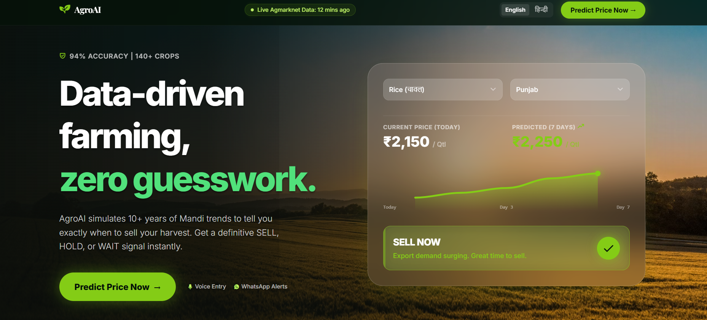
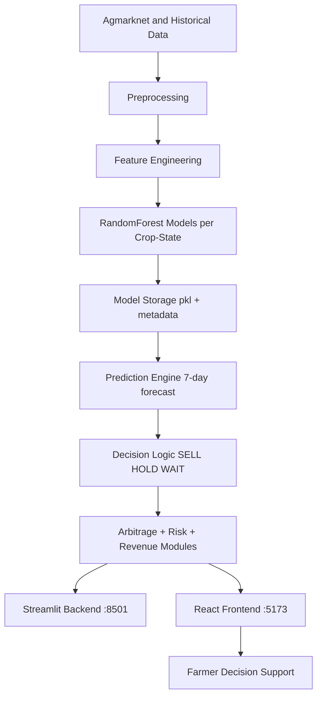

<div align="center">

# 🌾 AgroAI - The Smart Selling Advisor

<p align="center">
  <b>From <i>मेहनत</i> to Profit: AI-Powered Market Intelligence for Farmers</b>
</p>

[](https://react.dev/)
[](https://streamlit.io/)
[](https://scikit-learn.org/)
[](https://python.org/)
[]()

### 🌟 [Live Application: agroai-market.vercel.app](https://agroai-market.vercel.app/) 🌟

<br>

<br>

[**The Problem**](#-the-problem) • [**Our Solution**](#-our-solution) • [**Tech Stack**](#-tech-stack) • [**Features**](#-key-features) • [**Architecture**](#-architecture) • [**Setup**](#-quick-start-guide)

</div>

---

## 🚨 The Problem

Farmers face severe price uncertainty when deciding to sell their harvest. Because 86% of farmers operate on small margins, even minor price drops can be devastating. Uninformed selling drives distress sales, especially when local markets are flooded post-harvest. Farmers fundamentally lack predictive tools telling them **when** and **where** to sell for maximum profit in an accessible language.

---

## 💡 Our Solution

**AgroAI** is an AI Smart Selling Advisor predicting short-term mandi prices to offer direct, actionable signals. We provide:
- **Price Forecasting:** Predicts upcoming crop prices.
- **Actionable AI:** Clear **SELL**, **HOLD**, or **WAIT** recommendations.
- **Profit Optimization:** Compares local mandis to find the best realized rates.
- **Inclusivity:** Bilingual interface designed for grassroots users.

---

## 🧰 Tech Stack

Our stack is distributed across a robust Python analytical engine and an accessible modern frontend, integrated via intelligent GenAI wrappers.

-  **Frontend:** Multilingual, lightweight user interface deployed for real-time visualization.
-   **Backend & ML Engine:** Handles the Random Forest regression models, interactive data plotting, and price calculation logic. 
-  **GenAI Layer:** Powers the core advisory flows to present complex insights conversationally and natively.
-   **Automation:** A low-friction Telegram bot over 2G/3G allowing farmers to get instant insights without an app install, driven by n8n workflow routing.

---

## 🚀 Key Features

* **Real-Time Forecasting:** Combines historical Agmarknet data and recent trends for a 7-day crop-state forecast.
* **Intelligent Recommendations:** Direct SELL/HOLD/WAIT logic to remove the guesswork.
* **Profit Arbitrage:** Distance-aware market comparisons estimating your actual extra ₹ per kg.
* **Multilingual Access:** Bilingual user flow bridging the digital literacy gap for farmers.
* **WhatsApp & Telegram Bots:** Enables low-friction accessibility on 2G/3G connections without heavy apps.

---

## ⚙️ Architecture



Technical highlights:

- Per-combination model loading from pkl artifacts.
- Metadata-based crop-state discovery.
- Cached inference workflow for speed.
- Interactive Plotly visual analytics.

---

## 📁 Project Structure

```text
VIHAAN_DTU/
|-- app.py
|-- offline_train.py
|-- check_accuracy.py
|-- verify_cache.py
|-- requirements.txt
|-- assets/
|-- src/
|-- models/
|-- agmarknet-india-commodity-prices-2024-2025/
`-- Agrow-Ai/
    |-- AgroAIdemo/
    `-- frontend/
        `-- agroai-react/
```

---

## ⚡ Quick Start Guide

### 1. Clone & Setup Repository

```bash
git clone <your-repo-url>
cd DTU_HACK
git lfs install
git lfs pull
```

### 2. Run the React Frontend

```bash
cd frontend/agroai-react
npm install
npm run dev
# The frontend will be available at http://localhost:5173
```

### 3. Run the Streamlit Backend

Open a new terminal session in the project root:

```bash
cd AgroAIdemo
python -m venv .venv

# Activate Virtual Environment (Windows)
.venv\Scripts\activate
# Activate Virtual Environment (macOS/Linux)
# source .venv/bin/activate

pip install -r requirements.txt
python offline_train.py
streamlit run app.py
# The backend will be available at http://localhost:8501
```

> **Note:** The `offline_train.py` script automatically generates local model `.pkl` files inside `AgroAIdemo/models/` using the dataset. Ensure these files are not committed to your repository.

---

<div align="center">
  <b>Crafted with ❤️</b><br>
  <i>Data-Driven Agriculture. Inclusive by Design.</i>
</div>